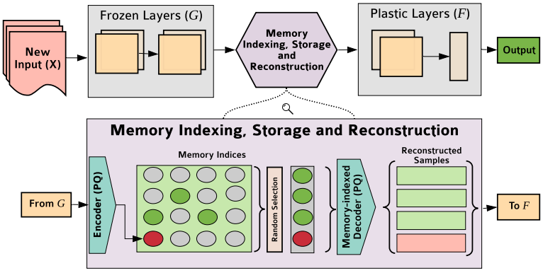

REMIND Your Neural Network to Prevent Catastrophic Forgetting
=====================================
This is a PyTorch implementation of the REMIND algorithm from our ECCV-2020 paper. An [arXiv pre-print](https://arxiv.org/abs/1910.02509) of our paper is available.

REMIND (REplay using Memory INDexing) is a novel brain-inspired streaming learning model that uses tensor quantization to efficiently store hidden representations (e.g., CNN feature maps) for later replay. REMIND implements this compression using Product Quantization (PQ) and outperforms existing models on the ImageNet and CORe50 classification datasets. Further, we demonstrate REMIND's robustness by pioneering streaming Visual Question Answering (VQA), in which an agent must answer questions about images.

Formally, REMIND takes an input image and passes it through frozen layers of a network to obtain tensor representations (feature maps). It then quantizes the tensors via PQ and stores the indices in memory for replay. The decoder reconstructs a previous subset of tensors from stored indices to train the plastic layers of the network before inference. We restrict the size of REMIND's replay buffer and use a uniform random storage policy.



## Dependencies 
We have tested the code with the following packages and versions:
- Python 3.7.6
- PyTorch (GPU) 1.3.1
- torchvision 0.4.2
- NumPy 1.18.5
- FAISS (CPU) 1.5.2
- CUDA 10.1 (also works with CUDA 10.0)
- Scikit-Learn 0.23.1
- Scipy 1.1.0
- NVIDIA GPU


We recommend setting up a `conda` environment with these same package versions:
```
conda create -n remind_proj python=3.7
conda activate remind_proj
conda install numpy=1.18.5
conda install pytorch=1.3.1 torchvision=0.4.2 cudatoolkit=10.1 -c pytorch
conda install faiss-cpu=1.5.2 -c pytorch
```

## Setup ImageNet-2012
The ImageNet Large Scale Visual Recognition Challenge (ILSVRC) dataset has 1000 categories and 1.2 million images. The images do not need to be preprocessed or packaged in any database, but the validation images need to be moved into appropriate subfolders. [See link.](https://github.com/facebook/fb.resnet.torch/blob/master/INSTALL.md#download-the-imagenet-dataset)

1. Download the images from http://image-net.org/download-images

2. Extract the training data:
    ```bash
    mkdir train && mv ILSVRC2012_img_train.tar train/ && cd train
    tar -xvf ILSVRC2012_img_train.tar && rm -f ILSVRC2012_img_train.tar
    find . -name "*.tar" | while read NAME ; do mkdir -p "${NAME%.tar}"; tar -xvf "${NAME}" -C "${NAME%.tar}"; rm -f "${NAME}"; done
    cd ..
    ```

3. Extract the validation data and move images to subfolders:
    ```bash
    mkdir val && mv ILSVRC2012_img_val.tar val/ && cd val && tar -xvf ILSVRC2012_img_val.tar
    wget -qO- https://raw.githubusercontent.com/soumith/imagenetloader.torch/master/valprep.sh | bash
    ```


## Repo Structure & Descriptions

 * [image_classification_experiments](./image_classification_experiments): files to replicate image classification experiments
   * [imagenet_files](./image_classification_experiments/imagenet_files): files needed to run ImageNet experiments
     * [imagenet_indices](./image_classification_experiments/imagenet_files/imagenet_indices): contains numpy files of labels for our ImageNet ordering
       * [imagenet_train_labels.npy](./image_classification_experiments/imagenet_files/imagenet_indices/imagenet_train_labels.npy): numpy array with train labels for our ordering (can be generated for different order)
       * [imagenet_val_labels.npy](./image_classification_experiments/imagenet_files/imagenet_indices/imagenet_val_labels.npy): numpy array with val labels for our ordering (can be generated for different order)
     * [best_ResNet18ClassifyAfterLayer4_1_100.pth](./image_classification_experiments/imagenet_files/best_ResNet18ClassifyAfterLayer4_1_100.pth): our base init ckpt file trained on 100 fixed random classes of ImageNet (can be generated for different order)
     * [imagenet_class_order.txt](./image_classification_experiments/imagenet_files/imagenet_class_order.txt): text file containing names of classes in order for training (supply this file for different order)
   * [imagenet_base_initialization.py](./image_classification_experiments/imagenet_base_initialization.py): script to train an offline network on the base initialization data for ImageNet
   * [imagenet_experiment.py](./image_classification_experiments/imagenet_experiment.py): script to train the streaming REMIND model on ImageNet
   * [make_numpy_imagenet_label_files.py](./image_classification_experiments/make_numpy_imagenet_label_files.py): script to make `imagenet_train_labels.npy` and `imagenet_val_labels.npy` for particular ImageNet ordering
   * [REMINDModel.py](./image_classification_experiments/REMINDModel.py): class for REMIND model
   * [resnet_models.py](./image_classification_experiments/resnet_models.py): file containing variations of ResNet-18 architectures used in our experiments
   * [retrieve_any_layer.py](./image_classification_experiments/retrieve_any_layer.py): script to extract features from different layers of a model
   * [run_imagenet_experiment.sh](./image_classification_experiments/run_imagenet_experiment.sh): bash script to run the streaming REMIND model on ImageNet
   * [train_base_init_network.sh](./image_classification_experiments/train_base_init_network.sh): bash script to train the base init model on a subset of ImageNet
   * [train_base_init_network_from_scratch.py](./image_classification_experiments/train_base_init_network_from_scratch.py): script to train the base init model for ImageNet
   * [utils.py](./image_classification_experiments/utils.py): overall utilities
   * [utils_imagenet.py](./image_classification_experiments/utils_imagenet.py): ImageNet specific utilities

## Training REMIND on ImageNet (Classification)
We have provided the necessary files to train REMIND on the exact same ImageNet ordering used in our paper (provided in `imagenet_class_order.txt`). We also provide steps for running REMIND on an alternative ordering.

#### To train REMIND on the ImageNet ordering from our paper, follow the steps below:

1. Run `run_imagenet_experiment.sh` to train REMIND on the ordering from our paper. Note, this will use our ordering and associated files provided in `imagenet_files`.

#### To train REMIND on a different ImageNet ordering, follow the steps below:

1. Generate a text file containing one class name per line in the desired order.
2. Run `make_numpy_imagenet_label_files.py` to generate the necessary numpy files for the desired ordering using the text file from step 1.
3. Run `train_base_init_network.sh` to train an offline model using the desired ordering and label files generated in step 2 on the base init data.
4. Run `run_imagenet_experiment.sh` using the label files from step 2 and the ckpt file from step 3 to train REMIND on the desired ordering.

#### Files generated from the streaming experiment:

- `*.json` files containing incremental top-1 and top-5 accuracies
- `*.pth` files containing incremental model predictions/probabilities
- `*.pth` files containing incremental REMIND classifier (F) weights
- `*.pkl` files containing PQ centroids and incremental buffer data (e.g., latent codes)

#### To continue training REMIND from a previous ckpt:
We save out incremental weights and associated data for REMIND after each evaluation cycle. This enables REMIND to continue training from these saved files (in case of a computer crash etc.). This can be done as follows in `run_imagenet_experiment.sh`:

1. Set the `--resume_full_path` argument to the path where the previous REMIND model was saved.
2. Set the `--streaming_min_class` argument to the class REMIND left off on.
3. Run `run_imagenet_experiment.sh`

## Training REMIND on VQA Datasets
We use the gensen library for question features. Execute the following steps to set it up:
```
cd ${GENSENPATH} 
git clone git@github.com:erobic/gensen.git
cd ${GENSENPATH}/data/embedding
chmod +x glove25.sh && ./glove2h5.sh    
cd ${GENSENPATH}/data/models
chmod +x download_models.sh && ./download_models.sh
```

### Training REMIND on CLEVR 
_Note: For convenience, we pre-extract all the features including the PQ encoded features. This requires 140 GB of free space, assuming images are deleted after feature extraction._
1. Download and extract CLEVR images+annotations:
    ```bash
    wget https://dl.fbaipublicfiles.com/clevr/CLEVR_v1.0.zip
    unzip CLEVR_v1.0.zip
    ```
   
2. Extract question features
    - Clone the gensen repository and download glove features:
    ```
    cd ${GENSENPATH} 
    git clone git@github.com:erobic/gensen.git
    cd ${GENSENPATH}/data/embedding
    chmod +x glove25.sh && ./glove2h5.sh    
    cd ${GENSENPATH}/data/models
   chmod +x download_models.sh && ./download_models.sh
    ```
    
    - Edit `vqa_experiments/clevr/extract_question_features_clevr.py`, changing the `DATA_PATH` variable to point to CLEVR dataset and `GENSEN_PATH` to point to gensen repository and extract features:
    `python vqa_experiments/clevr/extract_question_features_clevr.py`
    
    - Pre-process the CLEVR questions
    Edit `$PATH` variable in `vqa_experiments/clevr/preprocess_clevr.py` file, pointing it to the directory where CLEVR was extracted
    
3. Extract image features, train PQ encoder and extract encoded features 
    - Extract image features: `python -u vqa_experiments/clevr/extract_image_features_clevr.py --path /path/to/CLEVR`
    - In `pq_encoding_clevr.py`, change the value of `PATH` and `streaming_type` (as either 'iid' or 'qtype')
    - Train PQ encoder and extract features: `python vqa_experiments/clevr/pq_encoding_clevr.py`

4. Train REMIND
    - Edit `data_path` in `vqa_experiments/configs/config_CLEVR_streaming.py`
    - Run `./vqa_experiments/run_clevr_experiment.sh` (Set `DATA_ORDER` to either `qtype` or `iid` to define the data order)

### Training REMIND on TDIUC
_Note: For convenience, we pre-extract all the features including the PQ encoded features. This requires around 170 GB of free space, assuming images are deleted after feature extraction._
1. Download TDIUC
    ```
    cd ${TDIUC_PATH}
    wget https://kushalkafle.com/data/TDIUC.zip && unzip TDIUC.zip
    cd TDIUC && python setup.py --download Y # You may need to change print '' statements to print('')
    ```
   
2. Extract question features    
    - Edit `vqa_experiments/clevr/extract_question_features_tdiuc.py`, changing the `DATA_PATH` variable to point to TDIUC dataset and `GENSEN_PATH` to point to gensen repository and extract features:
    `python vqa_experiments/tdiuc/extract_question_features_tdiuc.py`
    
    - Pre-process the TDIUC questions
    Edit `$PATH` variable in `vqa_experiments/clevr/preprocess_tdiuc.py` file, pointing it to the directory where TDIUC was extracted
    
3. Extract image features, train PQ encoder and extract encoded features 
    - Extract image features: `python -u vqa_experiments/tdiuc/extract_image_features_tdiuc.py --path /path/to/TDIUC`
    - In `pq_encoding_tdiuc.py`, change the value of `PATH` and `streaming_type` (as either 'iid' or 'qtype')
    - Train PQ encoder and extract features: `python vqa_experiments/clevr/pq_encoding_clevr.py`
    
4. Train REMIND
    - Edit `data_path` in `vqa_experiments/configs/config_TDIUC_streaming.py`
    - Run `./vqa_experiments/run_tdiuc_experiment.sh` (Set `DATA_ORDER` to either `qtype` or `iid` to define the data order)


## Citation
If using this code, please cite our paper.
```
@inproceedings{hayes2020remind,
  title={REMIND Your Neural Network to Prevent Catastrophic Forgetting},
  author={Hayes, Tyler L and Kafle, Kushal and Shrestha, Robik and Acharya, Manoj and Kanan, Christopher},
  booktitle={Proceedings of the European Conference on Computer Vision (ECCV)},
  year={2020}
}
```
